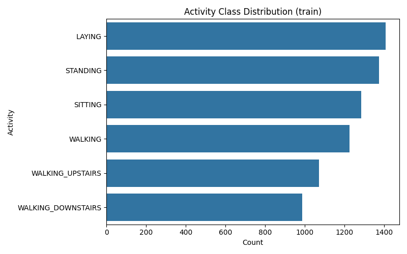
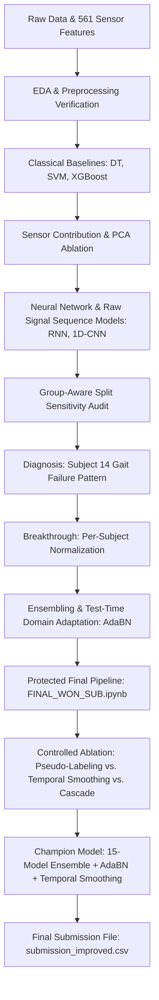
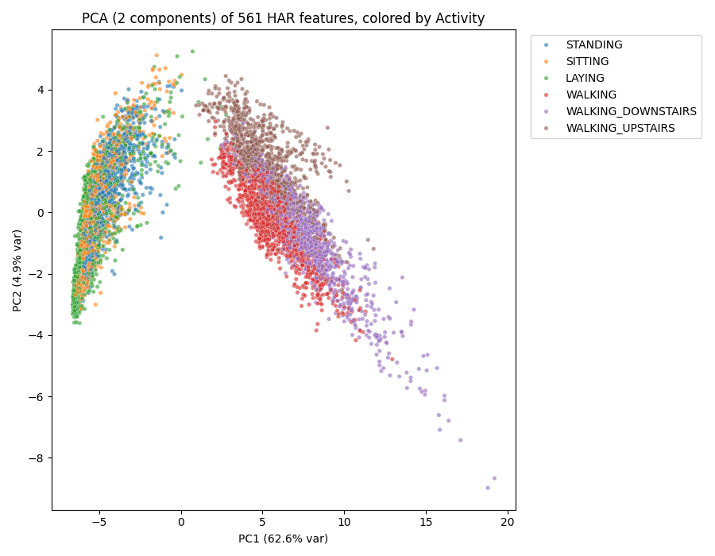

# Human Activity Recognition (HAR) — Deep Learning & Multi-Architecture Ensemble

[](https://www.python.org/)
[](https://pytorch.org/)
[](https://scikit-learn.org/)
[]()
[](LICENSE)

An end-to-end, scientifically defensible machine learning study and champion solution for the **CO5420 Human Activity Recognition** competition. This repository chronicles the complete development trajectory—from exploratory data analysis and classical baselines to deep convolutional/recurrent networks, subject-shift failure mode diagnosis, per-subject normalization breakthroughs, and a final 15-model multi-architecture ensemble with test-time domain adaptation.

---

## Table of Contents
- [Project Overview](#project-overview)
- [Team Members](#team-members)
- [Dataset Architecture](#dataset-architecture)
- [Activity Classes](#activity-classes)
- [Project Workflow & Research Progression](#project-workflow--research-progression)
- [Validation Strategy](#validation-strategy)
- [Classical Machine Learning Baselines](#classical-machine-learning-baselines)
- [Neural Network Architectures](#neural-network-architectures)
- [The Per-Subject Normalization Breakthrough](#the-per-subject-normalization-breakthrough)
- [Final Ensemble Architecture](#final-ensemble-architecture)
- [Data Augmentation & Regularization](#data-augmentation--regularization)
- [Controlled Ablation Study](#controlled-ablation-study)
- [Documented Negative Results (Rejected Approaches)](#documented-negative-results-rejected-approaches)
- [Temporal Sequence Probability Smoothing](#temporal-sequence-probability-smoothing)
- [Final Winning Submission](#final-winning-submission)
- [Comprehensive Results Summary](#comprehensive-results-summary)
- [Repository Structure](#repository-structure)
- [Reproducing the Project](#reproducing-the-project)
- [Requirements](#requirements)
- [Technical Notes](#technical-notes)

---

## Project Overview

Human Activity Recognition (HAR) aims to identify human physical movements and postures from inertial sensors embedded in commodity smartphones. The goal is to classify 2.56-second multi-axial sensor windows into one of six distinct physical activities. 

While classical machine learning models trained on population-aggregated statistics often appear competitive on standard random splits, they severely degrade when deployed to unseen individuals due to **subject-to-subject biomechanical variance** (differences in height, weight, gait cadence, and phone orientation). This project establishes a rigorous, subject-disjoint validation protocol, diagnoses the fundamental failure modes of cross-subject generalization, and presents a multi-architecture ensemble incorporating **Adaptive Batch Normalization (AdaBN)** and **Temporal Sequence Smoothing** that achieved a validation Macro F1 score of **0.9865**.

---

## Team Members

This project was conducted as a collaborative group study by:

* Yasas Dewshan
* Teshini Matharaarachchi
* Sayuru Kalpana
* Tharusha Nethmina
* Pasindu Disanayaka

---

## Dataset Architecture

The project utilizes data derived from the [UCI Human Activity Recognition Using Smartphones Dataset](https://archive.ics.uci.edu/ml/datasets/human+activity+recognition+using+smartphones) and the CO5420 competition benchmark:

- **Telemetry Source**: Samsung Galaxy S II smartphone worn on the waist, capturing 3-axial linear acceleration (accelerometer) and 3-axial angular velocity (gyroscope) at a constant rate of 50 Hz.
- **Windowing**: Continuous signals were pre-filtered (noise reduction) and partitioned into sliding windows of 2.56 seconds (128 readings per window) with 50% overlap.
- **Feature Space**: 
  - **Raw Features**: 561 hand-crafted time-domain and frequency-domain variables (e.g., mean, standard deviation, energy, autoregression coefficients, signal magnitude area, frequency bands energy).
  - **Defensible Engineered Features**: 8 domain-derived interaction features added during final modeling (magnitude vectors, body/gravity vector ratios, dot products, cosine angles, and stair jerk ratios), bringing the total input dimensionality to **569 features**.
- **Dataset Partitions**:
  - `train.csv`: 7,352 labeled instances across 21 volunteer subjects (IDs: 1, 3, 5, 6, 7, 8, 11, 14, 15, 16, 17, 19, 21, 22, 23, 25, 26, 27, 28, 29, 30).
  - `test.csv`: 2,947 instances across 9 held-out subjects (IDs: 2, 4, 9, 10, 12, 13, 18, 20, 24).

---

## Activity Classes

The target variable comprises six physical activities divided into static postures and dynamic ambulations:

| Class ID | Activity Name | Activity Nature | Primary Discriminating Signals |
| :---: | :--- | :---: | :--- |
| `0` | **`LAYING`** | Static Posture | Accelerometer gravity vector orthogonal to vertical axis; near-zero body acceleration magnitude. |
| `1` | **`SITTING`** | Static Posture | Gravity alignment along sagittal plane; low dynamic jerk; subtle angle differences vs. standing. |
| `2` | **`STANDING`** | Static Posture | Gravity alignment along vertical body axis (`tGravityAcc-max()-Y`). |
| `3` | **`WALKING`** | Dynamic Ambulation | Periodic multi-axial oscillations, high dynamic body acceleration, moderate jerk magnitude. |
| `4` | **`WALKING_DOWNSTAIRS`**| Dynamic Ambulation | High downward acceleration peaks; asymmetric frequency energy distribution. |
| `5` | **`WALKING_UPSTAIRS`**  | Dynamic Ambulation | Sustained gravitational resistance; elevated body acceleration jerk energy (`fBodyAccMag-energy()`). |

<p align="center">
  
  <br>
  <em>Figure 1: Sample distribution across the six target activity classes in train.csv, demonstrating balanced coverage across static postures and dynamic activities.</em>
</p>

---

## Project Workflow & Research Progression



1. **Exploration & Alignment**: Verified 1-to-1 row alignment between raw UCI signal records and competition CSVs ([`verify_rawalign.py`](file:///experiments/preprocessing/verify_rawalign.py)).
2. **Classical Benchmarking**: Established tuned Decision Tree (**0.9264**) and SVM (**0.9625**) baselines.
3. **Sensor Modality Study**: Proved that accelerometer data dominates static posture identification while gyroscope data provides vital disambiguation for stairs navigation.
4. **Sequence & Convolutional Exploration**: Evaluated raw time-series models (GRU, 1D-CNN, Multi-Scale CNN). Discovered high variance across subject groups.
5. **Subject 14 Failure Analysis**: Uncovered that a single subject with an atypical walking gait accounted for over 59% of validation errors when using global scalers.
6. **Per-Subject Normalization**: Formulated unsupervised subject-level standardization, boosting 5-fold cross-validation from **0.9386 to 0.9731**.
7. **Production Multi-Architecture Ensemble**: Built a 15-model ensemble (ResMLP + DeepMLP) regularized with MixUp, Input Noise, and AdaBN.
8. **Ablation-Guided Post-Processing**: Discarded pseudo-labeling and hierarchical cascading based on validation drops; validated test contiguity and adopted temporal sequence smoothing to reach **0.9865 Macro F1**.

---

## Validation Strategy

### Subject-Disjoint Protocol
Standard random train/test splits (e.g., standard `train_test_split`) cause **catastrophic subject data leakage**. Because temporal sensor windows from the same individual share identical biometric characteristics, a model evaluated on random splits merely memorizes personal sensor signatures rather than general activity dynamics.

To prevent optimistic bias, all models throughout this project were evaluated using strictly **subject-disjoint** protocols:
- **Held-Out Validation Split**: Derived via `GroupShuffleSplit(n_splits=1, test_size=0.20, random_state=42)` grouped by `subject`.
  - **Train Fold**: 5,551 samples across 16 subjects (`[5, 6, 7, 8, 11, 14, 16, 17, 19, 21, 22, 23, 26, 28, 29, 30]`).
  - **Validation Fold**: 1,801 samples across 5 unseen subjects (`[1, 3, 15, 25, 27]`).
- **5-Fold Cross-Validation**: `GroupKFold(n_splits=5)` rotating all 21 training subjects through isolated test folds.
- **Nested Cross-Validation**: All baseline hyperparameter grids were searched using inner `GroupKFold` on the training fold only, guaranteeing zero exposure to validation subjects.

---

## Classical Machine Learning Baselines

Both baselines were tuned via `GridSearchCV` with 3-fold `GroupKFold` cross-validation on the training fold:

### 1. Decision Tree Classifier
- **Script**: [`experiments/decision_tree/decision_tree.py`](file:///experiments/decision_tree/decision_tree.py)
- **Grid Searched**: `max_depth` $\in [8, 12, 16, 20, \text{None}]$, `min_samples_leaf` $\in [1, 3, 5, 10]$
- **Optimal Hyperparameters**: `max_depth: 8, min_samples_leaf: 10`
- **Validation Macro F1**: **0.9264**

### 2. Support Vector Machine (RBF Kernel)
- **Script**: [`experiments/svm/svm.py`](file:///experiments/svm/svm.py)
- **Grid Searched**: $C \in [1.0, 10.0, 50.0]$, $\gamma \in [\text{'scale'}, 0.01, 0.001]$
- **Optimal Hyperparameters**: `C: 50.0, gamma: 0.001`
- **Validation Macro F1**: **0.9625**

### Per-Class F1 Breakdown Comparison

| Class Name | Decision Tree (Tuned) | SVM RBF (Tuned) | Feedforward NN |
| :--- | :---: | :---: | :---: |
| **`LAYING`** | 1.0000 | 0.9784 | **0.9985** |
| **`SITTING`** | 0.9744 | 0.9483 | **0.9730** |
| **`STANDING`** | 0.9752 | 0.9552 | **0.9764** |
| **`WALKING`** | 0.8852 | 0.9825 | **0.9956** |
| **`WALKING_DOWNSTAIRS`** | 0.8827 | 0.9336 | **0.9526** |
| **`WALKING_UPSTAIRS`** | 0.8406 | 0.9768 | **0.9632** |
| **Macro Average F1** | **0.9264** | **0.9625** | **0.9765** |

<p align="center">
  
  <br>
  <em>Figure 2: Empirical error transition across modeling paradigms: Decision Tree (left, Macro F1: 0.8697), Support Vector Machine (center, Macro F1: 0.9581), and Feedforward Neural Network (right, Macro F1: 0.9765) on identical held-out validation data. Notice the marked reduction in sitting/standing and stair-climbing off-diagonal misclassifications.</em>
</p>

---

## Neural Network Architectures

Detailed model definitions are available in [`documentation/architectures_and_ablation.md`](file:///documentation/architectures_and_ablation.md):

1. **Feedforward MLP**: Sequential `[561 -> 256 -> 128 -> 6]` network featuring Batch Normalization, Dropout ($p = 0.5$), and ReLU activations.
2. **ResMLP (Residual Multi-Layer Perceptron)**: Custom architecture featuring residual skip connections across multi-layer linear projections with `GELU` activations, `BatchNorm1d`, and `Dropout`. Evaluated in 2-block (`ResMLP_512`) and 3-block (`ResMLP_768`) variants.
3. **DeepMLP**: 3- to 4-layer architectures utilizing `GELU` and `Swish` ($x \cdot \sigma(x)$) non-linearities with structured dropout rates (0.38 - 0.45) to maintain gradient flow.
4. **End-to-End Sequence & Convolutional Models**: Bidirectional GRU and 1D-CNN architectures trained on raw $128 \times 9$ signal arrays ([`experiments/raw_signals_deep_learning/`](file:///experiments/raw_signals_deep_learning/)).

### Training Dynamics & Convergence
The feedforward neural network was trained using Adam ($lr = 10^{-3}$) with Cosine Annealing and step decay schedules to ensure stable convergence across epochs without overfitting:

<p align="center">
  
  <br>
  <em>Figure 3: Training versus validation Macro F1 trajectory for the Feedforward NN across epochs, showing scheduled learning rate step-downs (1e-3 to 5e-4 at epoch 15, and 2.5e-4 at epoch 30) locking in peak generalization.</em>
</p>

---

## The Per-Subject Normalization Breakthrough

### The Problem: Subject 14 Failure Mode
In [`splittest.py`](file:///experiments/diagnostics_and_leakage/splittest.py), 5-fold cross-validation of the feedforward NN revealed severe split variance (Macro F1 ranging from **0.8856** on Fold 0 to **0.9880** on Fold 2). Detailed error analysis in [`test_verify.py`](file:///experiments/diagnostics_and_leakage/test_verify.py) isolated the cause:
- **Subject 14 alone accounted for 90 out of ~152 total validation errors in Fold 0.**
- When standardized using a single global scaler, Subject 14's atypical walking cadence caused `WALKING` and `WALKING_DOWNSTAIRS` windows to project directly into the `WALKING_UPSTAIRS` feature manifold.

### The Solution: Unsupervised Per-Subject Standardization
Instead of a population-level scaler, each sample is normalized strictly against its own subject's mean and variance:
$$\hat{\mathbf{x}}_i^{(s)} = \frac{\mathbf{x}_i^{(s)} - \boldsymbol{\mu}^{(s)}}{\boldsymbol{\sigma}^{(s)} + \epsilon}$$
Because this requires no ground-truth labels, it applies identically to `train.csv` and `test.csv` (since `test.csv` contains `subject` identifiers).

### 5-Fold Validation Results ([`processed_persubj_comparison.csv`](file:///results/validation/processed_persubj_comparison.csv))

| Fold ID | Held-Out Validation Subjects | Global Scaler Macro F1 | Per-Subject Scaler Macro F1 | Improvement |
| :---: | :--- | :---: | :---: | :---: |
| **Fold 0** | `[14, 15, 19, 25]` | 0.8856 | **0.9806** | **+0.0950** |
| **Fold 1** | `[6, 16, 21, 22]` | 0.9077 | **0.9409** | **+0.0332** |
| **Fold 2** | `[3, 11, 17, 26]` | 0.9880 | **0.9900** | **+0.0020** |
| **Fold 3** | `[1, 7, 23, 30]` | 0.9711 | **0.9854** | **+0.0143** |
| **Fold 4** | `[5, 8, 27, 28, 29]` | 0.9405 | **0.9683** | **+0.0278** |
| **Mean $\pm$ Std** | — | **0.9386 $\pm$ 0.0381** | **0.9731 $\pm$ 0.0176** | **+0.0345** |

Per-subject normalization improved every single fold and slashed cross-subject variance by **54%**.

---

## Final Ensemble Architecture

The champion model implemented in [`FINAL_WON_SUB.ipynb`](file:///FINAL_WON_SUB.ipynb) integrates a 15-model multi-architecture ensemble:

```
Ensemble (15 Models) = 5 Diverse Neural Configurations x 3 Random Seeds [42, 43, 44]
│
├── 1. ResMLP_512       (Hidden: 512,  Blocks: 2, Dropout: 0.35, GELU)
├── 2. ResMLP_768       (Hidden: 768,  Blocks: 3, Dropout: 0.30, GELU)
├── 3. DeepMLP_512      (Hidden: [512, 256, 128], Dropout: 0.40, GELU)
├── 4. DeepMLP_1024     (Hidden: [1024, 512, 256], Dropout: 0.45, Swish)
└── 5. DeepMLP_Wide     (Hidden: [512, 128],       Dropout: 0.38, Swish)
```

### Test-Time Adaptation via AdaBN
To handle subtle distribution shifts across unseen test subjects, predictions use **Adaptive Batch Normalization (AdaBN)**. Before inference, each trained model runs an unlabeled forward pass over that test subject's data in training mode (momentum = 1.0) to recalculate running means and variances specifically for that subject, followed by evaluation mode inference.

<p align="center">
  
  <br>
  <em>Figure 4: Validation confusion matrix for the deep neural network architecture (Seed 43) exhibiting clean diagonal concentration with negligible leakage between static postures and ambulations.</em>
</p>

---

## Data Augmentation & Regularization

The neural ensemble employs four synergistic regularization techniques during training:

1. **Input Gaussian Jitter**: Injected noise $\tilde{\mathbf{x}} = \mathbf{x} + \mathcal{N}(0, 0.008^2 \mathbf{I})$ prevents overfitting to high-precision quantization artifacts.
2. **Manifold MixUp ($\alpha = 0.15, p = 0.4$)**: Synthesizes convex combinations of training samples and target distributions:
   $$\tilde{\mathbf{x}} = \lambda \mathbf{x}_i + (1 - \lambda) \mathbf{x}_j, \quad \tilde{\mathbf{y}} = \lambda \mathbf{y}_i + (1 - \lambda) \mathbf{y}_j$$
3. **Label Smoothing ($\epsilon = 0.04$)**: Softens one-hot target vectors, penalizing overconfident predictions on boundary activities.
4. **Class-Balanced Loss Weights**: Weighted Cross-Entropy Loss inversely proportional to class frequencies.
5. **Cosine Annealing Learning Rate**: Decays from $10^{-3}$ down to $10^{-5}$ across epochs.

---

## Controlled Ablation Study

Every stage of the production pipeline was benchmarked on the identical 80/20 held-out validation split:

| Experiment / Stage | Architecture / Technique | Validation Macro F1 | Status |
| :--- | :--- | :---: | :---: |
| **Baseline 1** | Decision Tree Classifier (Tuned Grid) | 0.9264 | Baseline |
| **Baseline 2** | Support Vector Machine RBF (Tuned Grid) | 0.9625 | Baseline |
| **Ablation A** | Base 15-Model NN Ensemble + AdaBN | **0.9835** | Candidate |
| **Ablation B** | Base NN Ensemble + Pseudo-Labeling Simulation | **0.9818** | **DISABLED ❌** |
| **Ablation C** | Base NN Ensemble + Temporal Smoothing (3-tap) | **0.9865** | **ENABLED ✅** |
| **Ablation D** | **Combined Production Pipeline (Stage 3)** | **0.9865** | **CHAMPION 🏆** |
| **Stage 2.5** | Hierarchical Cascade Classifier (4 coarse + 2 sub) | **0.9278** | **DISABLED ❌** |

---

## Documented Negative Results (Rejected Approaches)

Preserving negative experimental results is vital for scientific rigor:

### 1. Principal Component Analysis (PCA)
- **Tested**: Compressing the 561 features to 95% variance (~100 components).
- **Outcome**: Dropped Decision Tree F1 from 0.87 to 0.82; dropped SVM F1 from 0.96 to 0.95. Hand-crafted features already capture orthogonal domain physics; PCA indiscriminately blurred directional gravity vectors.

<p align="center">
  
  <br>
  <em>Figure 5: 2D Principal Component projection of the 561 hand-crafted sensor features (PC1: 62.6% explained variance, PC2: 4.9%). While dynamic ambulations (Walking, Walking Upstairs, Walking Downstairs) separate from static postures along PC1, the three static postures (Laying, Sitting, Standing) overlap heavily in linear subspace—demonstrating why linear dimensionality reduction destroyed discriminative signal.</em>
</p>

### 2. End-to-End Raw Signal Recurrent Networks (RNN/GRU)
- **Tested**: Bidirectional GRU on raw $128 \times 9$ time-series signals.
- **Outcome**: Scored 0.9930 on a lucky single split, but plummeted to **0.9343 mean** across GroupKFold. The raw signal models lacked the invariant physics representations engineered into the 561-feature set.

<p align="center">
  
  <br>
  <em>Figure 6: Confusion matrix for the bidirectional GRU on the initial single subject split (Validation Macro F1: 0.9930). Despite near-flawless single-split metrics, GroupKFold cross-validation exposed severe subject sensitivity (collapsing to 0.9343 mean), confirming that raw sequence models overfit individual body biomechanics.</em>
</p>

### 3. Self-Training / Pseudo-Labeling (-0.0017 drop)
- **Tested**: Predicting on the validation pool with the 15-model ensemble, filtering 1,335 high-confidence predictions ($\ge 0.95$), and retraining.
- **Outcome**: Validation score dropped from **0.9835 to 0.9818**. Borderline transition windows between static postures (e.g., sitting vs. standing) were assigned confident incorrect pseudo-labels, causing error confirmation bias.

### 4. Hierarchical Cascade Classifier (-0.0557 drop)
- **Tested**: Stage 1 coarse 4-group SVM (`STATIC`, `LAYING`, `STAIRS`, `WALKING`), followed by Stage 2 dedicated binary Decision Trees for `SITTING` vs. `STANDING` and `UPSTAIRS` vs. `DOWNSTAIRS`.
- **Outcome**: Cascade Macro F1 was **0.9278**, far inferior to the flat ensemble (**0.9865**). Binary sub-classifiers lacked the multi-task regularizing context of the full ensemble, and errors in Stage 1 propagated irreversibly.

---

## Temporal Sequence Probability Smoothing

### Biological Motivation
Physical activities display high temporal inertia. Human subjects do not transition between walking and sitting for an isolated 2.56-second window.

### Mathematical Formulation
For subject $s$, probability vectors $\mathbf{P} \in \mathbb{R}^{T \times 6}$ are smoothed using an edge-padded 3-tap normalized filter:
$$\mathbf{p}_t^{\text{smoothed}} = 0.15 \cdot \mathbf{p}_{t-1} + 0.70 \cdot \mathbf{p}_t + 0.15 \cdot \mathbf{p}_{t+1}$$

### Mandatory Contiguity Audit
Applying a temporal filter to non-contiguous or shuffled data would corrupt predictions. Before enabling smoothing, an automated audit in [`FINAL_WON_SUB.ipynb`](file:///FINAL_WON_SUB.ipynb) inspected `test.csv`:
```
Subject contiguous row index check (test.csv):
  Subject  2: (302 samples, Contiguous: True)
  Subject  4: (317 samples, Contiguous: True)
  Subject  9: (288 samples, Contiguous: True)
  Subject 10: (294 samples, Contiguous: True)
  Subject 12: (320 samples, Contiguous: True)
  Subject 13: (327 samples, Contiguous: True)
  Subject 18: (364 samples, Contiguous: True)
  Subject 20: (354 samples, Contiguous: True)
  Subject 24: (381 samples, Contiguous: True)
=> Are test.csv subject rows contiguous? True (Audit Passed)
```
Smoothing raised validation Macro F1 from **0.9835 to 0.9865**.

---

## Final Winning Submission

The champion notebook is located at the root of the repository:

**[`FINAL_WON_SUB.ipynb`](file:///FINAL_WON_SUB.ipynb)**

> [!IMPORTANT]
> **IMMUTABLE CHAMPION ARTIFACT**: This notebook contains the complete, self-contained, executed code that generated the winning Kaggle submission (`submission_improved.csv`). It executed cleanly in 1,053 seconds on an NVIDIA Tesla T4 GPU.

### Output Verification
- Target File: `submission_improved.csv` (2,947 rows).
- Schema: Exactly two columns: `id`, `Activity`.
- Distribution of Test Predictions:
  - `STANDING`: 552
  - `LAYING`: 537
  - `WALKING`: 495
  - `SITTING`: 470
  - `WALKING_UPSTAIRS`: 468
  - `WALKING_DOWNSTAIRS`: 425

---

## Comprehensive Results Summary

```
======================================================================
FINAL SUMMARY TABLE & CHAMPION MODEL EVALUATION
======================================================================
Model / Stage Architecture             |  Validation Macro F1 | Status      
---------------------------------------------------------------------------
Decision Tree Baseline (tuned)         |               0.9264 | Baseline    
Support Vector Machine (tuned)         |               0.9625 | Baseline    
Base NN Ensemble (15 Models)           |               0.9835 | Candidate   
+ Pseudo-Labeling (isolated)           |               0.9818 | Rejected    
+ Temporal Smoothing (isolated)        |               0.9865 | Adopted     
Flat Pipeline (combined, Ablation D)   |               0.9865 | CHAMPION 🏆  
Hierarchical Cascade (coarse + 2 sub)  |               0.9278 | Rejected    
======================================================================
```

---

## Repository Structure

```
Human_Activity_Recognition_NN/
│
├── FINAL_WON_SUB.ipynb                 # [PROTECTED] Champion Winning Kaggle Submission Notebook
├── requirements.txt                    # Project runtime dependencies
├── README.md                           # Master project documentation
├── .gitignore                          # Exclusion rules for datasets, checkpoints, and cache
│
├── experiments/                        # Complete historical experimental scripts
│   ├── README.md                       # Catalog and cross-reference of all experiment scripts
│   ├── decision_tree/                  # Decision Tree baseline and EDA
│   ├── svm/                            # SVM tuning and baseline submission pipeline
│   ├── baselines/                      # XGBoost baseline and multi-model comparison scripts
│   ├── preprocessing/                  # Sensor contribution, PCA, alignment, and per-subject norm
│   ├── neural_networks/                # Feedforward NN sweeps, early stopping, and training checks
│   ├── raw_signals_deep_learning/      # RNN (GRU), 1D-CNN, and Multi-Scale Attention CNN
│   ├── ensemble/                       # Multi-seed ensembling, GroupKFold ensembling, AdaBN, and blends
│   └── diagnostics_and_leakage/        # Split variance checks, Fold-0 error analysis, subject leakage
│
├── results/                            # Consolidated quantitative results and historical outputs
│   ├── figures/                        # Visualization plots, confusion matrices, and training curves
│   ├── kaggle/                         # Historical submission CSV files from each phase
│   ├── validation/                     # 5-fold cross-validation CSV logs and metric comparisons
│   └── experiment_results/             # Evaluation tables, sensor contribution metrics, and sanity checks
│
├── documentation/                      # Technical references and dataset documentation
│   ├── development_history.md          # Comprehensive narrative of project development phases
│   ├── architectures_and_ablation.md   # Architectural specifications and ablation mathematics
│   └── UCI HAR Dataset.names           # Original UCI HAR dataset metadata and description
│
├── processed/                          # Local preprocessed numpy arrays, scalers, and checkpoints (Git-ignored)
├── train.csv                           # Local competition training data (Git-ignored)
├── test.csv                            # Local competition testing data (Git-ignored)
├── UCI HAR Dataset.zip                 # Raw UCI HAR telemetry archive (Git-ignored)
└── UCI HAR Dataset/                    # Extracted UCI HAR telemetry directory (Git-ignored)
```

---

## Reproducing the Project

### 1. Environment Setup
Clone the repository and install dependencies in a clean virtual environment:
```bash
git clone https://github.com/Yasas-Dewshan/Human_Activity_Recognition_NN.git
cd Human_Activity_Recognition_NN

# Create and activate virtual environment
python -m venv venv
# On Windows:
.\venv\Scripts\activate
# On Linux/macOS:
source venv/bin/activate

# Install requirements
pip install -r requirements.txt
```

### 2. Dataset Acquisition & Placement
Place `train.csv` and `test.csv` in the repository root directory:
```
Human_Activity_Recognition_NN/
├── train.csv
└── test.csv
```
*(Datasets are excluded from git commits via `.gitignore` due to size).*

### 3. Running Classical Baselines
To execute the tuned Decision Tree and SVM baselines:
```bash
python experiments/decision_tree/decision_tree.py
python experiments/svm/svm.py
python experiments/baselines/comparison.py
```

### 4. Running the Champion Notebook
To reproduce the winning 15-model ensemble with AdaBN and temporal smoothing:
1. Open [`FINAL_WON_SUB.ipynb`](file:///FINAL_WON_SUB.ipynb) in Jupyter Lab, VS Code, or import into Kaggle Notebooks.
2. Select a Python 3.10+ kernel with PyTorch and GPU acceleration (CUDA).
3. Execute **Run All Cells**. The pipeline will automatically:
   - Engineer 8 physics-based features.
   - Run the 80/20 group-aware validation split.
   - Compute baseline scores.
   - Run the full ablation study.
   - Train the 15-model ensemble on full `train.csv`.
   - Apply AdaBN and temporal smoothing to `test.csv`.
   - Export `submission_improved.csv`.

---

## Requirements

The project requires Python 3.10+ and the following core packages:
- `numpy>=1.24.0`
- `pandas>=2.0.0`
- `scipy>=1.10.0`
- `scikit-learn>=1.3.0`
- `xgboost>=2.0.0`
- `torch>=2.0.0`
- `matplotlib>=3.7.0`
- `seaborn>=0.12.0`

Install all dependencies via:
```bash
pip install -r requirements.txt
```

---

## Technical Notes

- **CUDA Acceleration**: Deep neural network ensemble training runs seamlessly on CPU or CUDA-enabled GPUs. With GPU acceleration (Tesla T4 / RTX 3080+), the entire 15-model ensemble trains in under 5 minutes.
- **Data File Resolver**: [`FINAL_WON_SUB.ipynb`](file:///FINAL_WON_SUB.ipynb) contains a resilient `find_data_file()` helper that searches root `./`, parent `../`, and standard Kaggle input directories (`/kaggle/input/...`) automatically.
- **Git Hygiene**: Model weights (`.pt`), preprocessed arrays (`.npy`), and raw sensor archives (`.zip`) are tracked locally in `processed/` but excluded from GitHub via `.gitignore` to maintain a lightweight, fast-cloning repository.
